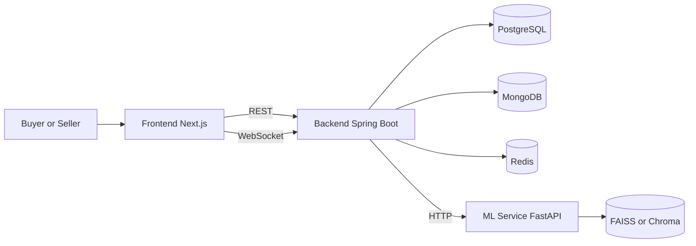

# PolyBazar

AI-assisted B2B marketplace for polymer granules and plastic waste trading.

## Architecture



## Repository Layout

```text
polybazar/
├── frontend/          # Next.js app
├── backend/           # Spring Boot API
├── ml-service/        # FastAPI ML service
├── scripts/           # Utility scripts
├── docker-compose.yml
└── .env.example
```

## Prerequisites

- Node.js 18+
- Java 17+
- Python 3.11+
- Docker + Docker Compose (recommended for dependencies)

## Environment Setup

```bash
cp .env.example .env
```

Update values in `.env` as needed. At minimum, configure database credentials and JWT secret for non-demo usage.

## Run Locally

### Option A: Start Everything with Docker Compose

```bash
docker-compose up --build
```

Expected local endpoints:
- Frontend: http://localhost:3000
- Backend: http://localhost:8080
- ML Service: http://localhost:8000
- Mongo Express: http://localhost:8081
- pgAdmin: http://localhost:5050

### Option B: Run Frontend Only

Use this when backend is already running elsewhere.

```bash
cd frontend
npm install
NEXT_PUBLIC_API_URL=http://localhost:8080 npm run dev
```

Frontend runs at http://localhost:3000.

### Option C: Run Backend Only

Start required dependencies first (PostgreSQL, MongoDB, Redis), then:

```bash
cd backend
./gradlew bootRun
```

Backend runs at http://localhost:8080.

Important backend env vars:
- `POSTGRES_URL`, `POSTGRES_USER`, `POSTGRES_PASSWORD`
- `MONGO_URI`
- `JWT_SECRET`
- `ML_SERVICE_URL` (optional if ML endpoints are not used)

### Option D: Run ML Service Only

```bash
cd ml-service
python -m venv .venv
source .venv/bin/activate
pip install -r requirements.txt
uvicorn app.main:app --host 0.0.0.0 --port 8000 --reload
```

ML service runs at http://localhost:8000.

## Manual Deployment on Render

This repository does not currently include a committed Render Blueprint file, so use manual service creation.

### 1. Prepare external services

Create these first:
- PostgreSQL (Render managed)
- Redis (Render managed)
- MongoDB (external provider such as MongoDB Atlas)

Collect connection values for each service.

### 2. Deploy backend as a Web Service

- Root Directory: `backend`
- Environment: Docker
- Port: `8080`
- Required env vars:
  - `SPRING_PROFILES_ACTIVE=prod`
  - `POSTGRES_URL`
  - `POSTGRES_USER`
  - `POSTGRES_PASSWORD`
  - `MONGO_URI`
  - `JWT_SECRET`
  - `ML_SERVICE_URL` (if ML service deployed)
  - `CORS_ORIGINS` (set to frontend Render URL)

### 3. Deploy ML service as a Web Service

- Root Directory: `ml-service`
- Environment: Docker
- Port: `8000`
- Typical env vars:
  - `VECTOR_DB_TYPE`
  - `EMBEDDING_MODEL`
  - `OPENAI_API_KEY` (if using OpenAI embeddings)

### 4. Deploy frontend as a Web Service

- Root Directory: `frontend`
- Environment: Docker
- Port: `3000`
- Required env vars:
  - `NEXT_PUBLIC_API_URL=https://<your-backend-service>.onrender.com`
  - `NEXT_PUBLIC_WS_URL=wss://<your-backend-service>.onrender.com/ws`

### 5. Post-deploy checks

- Open frontend URL and verify login/signup pages load.
- Hit backend actuator health endpoint if enabled.
- Verify one end-to-end flow (browse products, view details, call price prediction).

## Testing

```bash
# Backend
cd backend && ./gradlew test

# ML service
cd ml-service && pytest

# Frontend E2E
cd frontend && npm run cypress:run
```

## Notes

- See project analysis notes in `analysis/README.md`.
- Contribution guidelines: [CONTRIBUTING.md](CONTRIBUTING.md)
- License: [LICENSE](LICENSE)
